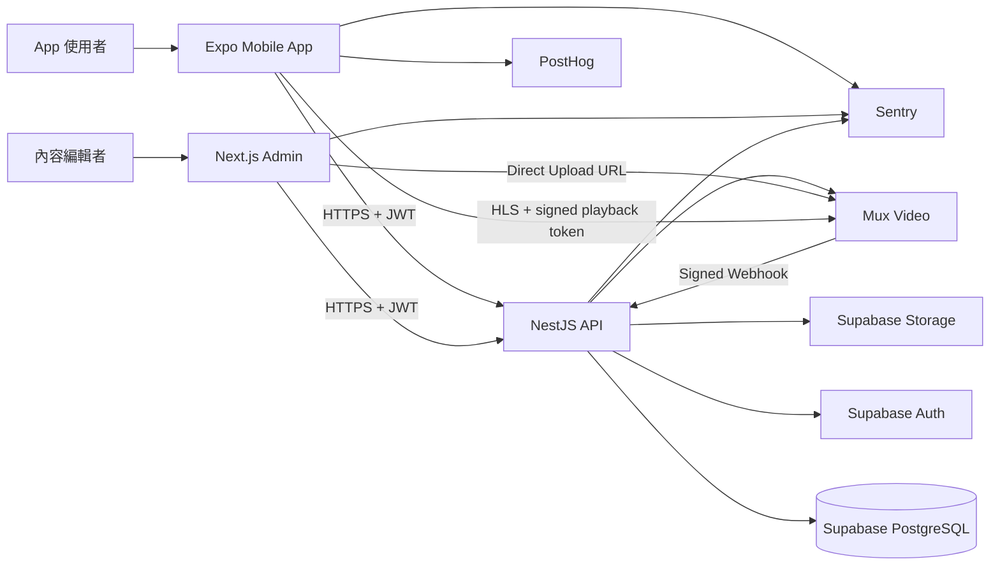

# HoopKit 系統架構文件

> 文件狀態：Proposed（MVP 架構基準）  
> 最後更新：2026-07-13  
> 適用範圍：HoopKit 行動 App、內容管理後台、API、資料庫與影音平台

## 1. 文件目的

本文件定義 HoopKit 從空白 repository 開始的技術架構、產品邊界、資料流、安全模型、環境規劃與建置順序。它是開發決策的基準，不是永遠不變的規格；任何會改變系統邊界、資料所有權或部署方式的決策，應透過 Architecture Decision Record（ADR）更新。

HoopKit 的產品核心是：

1. 提供球星、球員或教練示範的籃球動作內容。
2. 以短影片、動作拆解、使用時機、常見錯誤與練習方法呈現動作。
3. 提供球員或教練公開的訓練菜單模板。
4. 讓使用者收藏、排序、複製並編輯自己的訓練菜單。
5. 記錄每次訓練的執行結果，作為未來進度分析與個人化推薦基礎。

## 2. 架構原則

### 2.1 核心原則

- Server authoritative：權限、發布狀態、影片授權、模板匯入和資料所有權由 API 與資料庫驗證。
- Modular monolith first：MVP 使用模組化單體 API，不提早拆微服務。
- Data-driven content：球員、動作、教學段落、訓練項目與分類皆由資料驅動，不硬寫在 App。
- Explicit ownership：所有個人資料都必須具有明確 `user_id`，且由 Row Level Security（RLS）作第二層防護。
- API-first writes：涉及多表、權限或交易的一致性操作必須經過 API；公開內容可視需要直接讀 Supabase，但 MVP 統一由 API 讀取以減少兩套存取規則。
- Immutable history：已完成的訓練紀錄保存 snapshot，不因模板或菜單後續修改而改變。
- Licensed media only：不可把公開可觀看誤認為可下載、剪輯與重新散布。
- Measured scaling：先監測瓶頸，再加入搜尋引擎、queue、Redis 或微服務。

### 2.2 非目標（MVP 不做）

- 社群動態牆、留言與即時聊天。
- 自動下載第三方影音並重新剪輯。
- AI 姿勢辨識與投籃評分。
- 自建影音轉碼叢集。
- Kubernetes 與微服務拆分。
- 複雜訂閱分潤與創作者結算。
- 完整離線影片下載。

## 3. 技術選型

| 領域              | 選擇                             | 理由                                                                              |
| ----------------- | -------------------------------- | --------------------------------------------------------------------------------- |
| Mobile            | React Native + Expo + TypeScript | iOS/Android 共用大部分程式碼；Expo 提供 Router、原生模組、EAS Build/Update/Submit |
| Admin             | Next.js App Router + TypeScript  | 適合內容 CRUD、審核、上傳、Server Components 與 Vercel 部署                       |
| API               | NestJS + TypeScript              | 模組、DI、Guard、Pipe、Interceptor 與測試結構明確                                 |
| Database          | PostgreSQL（Supabase）           | 關聯資料、交易、JSONB、Full Text Search、RLS                                      |
| Authentication    | Supabase Auth                    | Email/social login、JWT 與 PostgreSQL/RLS 整合                                    |
| Images            | Supabase Storage（初期）         | 頭像、封面及非影音圖片；透過 bucket policy 控制                                   |
| Video             | Mux Video                        | Direct Upload、非同步轉碼、HLS、縮圖、clip 與 signed playback                     |
| Monorepo          | pnpm workspace + Turborepo       | 統一 lockfile、共享型別與平行執行 build/test/lint                                 |
| Validation        | Zod                              | Mobile、Admin、contracts 可共享；API 邊界仍由 DTO/Pipe 驗證                       |
| Server state      | TanStack Query                   | 快取、重試、失效與 optimistic update                                              |
| Local UI state    | Zustand                          | 僅保存播放器、暫存編輯狀態等本機狀態                                              |
| Observability     | Sentry                           | Mobile、Web、API exception 與 performance trace                                   |
| Product analytics | PostHog（建議）                  | 事件、漏斗、留存與 feature flag；不得上傳敏感自由文字                             |
| Deployment        | EAS + Vercel + Railway           | Mobile、Admin、API 分工清楚；未來可在不改 API 契約下替換 provider                 |

### 3.1 版本策略

- Node.js：初始化基準使用已驗證的 Node 22.23.1 LTS；repository 以 `.nvmrc`、`.node-version` 與 `package.json.engines` 固定相容範圍。升級 Node major 前需驗證 Expo、Next.js 與 NestJS。
- pnpm：由 Corepack 管理並在根 `package.json.packageManager` 固定精確版本。
- Expo、Next.js、NestJS：初始化當天使用相容的 stable release，不採 beta/RC。
- 所有 dependency 由 `pnpm-lock.yaml` 鎖定；CI 必須使用 frozen lockfile。
- 每月處理 patch/minor 更新；major upgrade 需建立獨立 PR、閱讀 migration guide 並跑完整驗證。

## 4. 系統上下文



### 4.1 Trust boundaries

- Mobile 與 Admin 都是不可信任 client；任何 client 傳入的 `user_id`、role、價格、發布狀態或媒體權限都不可直接採信。
- API 持有 server secrets，負責 privileged operation。
- Supabase service role key 只能存在 API/CI secret store，不得放入 `EXPO_PUBLIC_*` 或 `NEXT_PUBLIC_*`。
- Mux token secret 與 signing private key 只能存在 API。
- Database RLS 是 defense-in-depth，不取代 API authorization。

## 5. Repository 結構

```text
HoopKit/
├─ apps/
│  ├─ mobile/                    # Expo / React Native
│  │  ├─ app/                    # Expo Router routes
│  │  └─ src/
│  │     ├─ features/
│  │     ├─ components/
│  │     ├─ services/
│  │     ├─ hooks/
│  │     └─ infrastructure/
│  ├─ admin/                     # Next.js 管理後台
│  │  └─ src/
│  │     ├─ app/
│  │     ├─ features/
│  │     ├─ components/
│  │     └─ server/
│  └─ api/                       # NestJS modular monolith
│     └─ src/
│        ├─ modules/
│        ├─ common/
│        ├─ config/
│        └─ infrastructure/
├─ packages/
│  ├─ contracts/                # API request/response 與 domain DTO
│  ├─ validation/               # 可共享 Zod schema
│  ├─ database-types/           # Supabase CLI 產生；禁止手改
│  ├─ eslint-config/
│  ├─ typescript-config/
│  └─ design-tokens/            # 色彩、字級、間距；不共享平台 UI component
├─ supabase/
│  ├─ migrations/
│  ├─ tests/
│  ├─ seed.sql
│  └─ config.toml
├─ docs/
│  ├─ adr/
│  ├─ api/
│  ├─ database/
│  └─ product/
├─ .github/workflows/
├─ architecture.md
├─ pnpm-workspace.yaml
├─ turbo.json
├─ package.json
├─ .env.example
└─ README.md
```

### 5.1 共享程式碼規則

- 分享資料契約、驗證規則與 design tokens。
- 不強行分享 React Native 與 Web UI component；兩者 DOM/layout 模型不同。
- `contracts` 不得依賴 NestJS、Next.js 或 React Native，保持純 TypeScript。
- DB generated types 是 infrastructure type，不應直接成為所有 UI 的 domain model。

## 6. Domain 模組

### 6.1 Identity & Access

責任：登入、session、profile、角色與停權狀態。

角色：

- `user`：瀏覽、收藏、管理自己的菜單與訓練紀錄。
- `editor`：建立與編輯內容，但發布可依流程限制。
- `admin`：管理角色、發布、下架與系統設定。

授權資料應存在 server-controlled table 或 Supabase `app_metadata`；不可依賴使用者可自行修改的 metadata。

### 6.2 Players

責任：球員檔案、別名、位置、封面、公開狀態與搜尋。

### 6.3 Moves

責任：招式主資料、分類、標籤、教學段落、示範球員與相關動作。

詳細內容拆成結構化 section：overview、steps、key points、usage、timing、common mistakes、coaching cues、prerequisites、safety。避免只有一個不可驗證的大型 HTML 欄位。

### 6.4 Media

責任：圖片與影片 metadata、上傳狀態、clip、授權狀態、播放授權與 webhook。

### 6.5 Favorites

責任：收藏動作、收藏模板、收藏集合與使用者排序。

### 6.6 Workout Templates

責任：公開訓練模板、模板 section、item、版本、發布與下架。

### 6.7 Workout Plans

責任：使用者自訂菜單、從模板匯入、項目編輯與排序。

### 6.8 Workout Sessions

責任：開始訓練、逐項完成、休息計時結果、完成／放棄與歷史 snapshot。

## 7. 核心資料模型

所有時間欄位使用 `timestamptz` 並以 UTC 保存；前端依使用者 timezone 顯示。主鍵預設使用 UUID。所有可排序 child table 使用穩定排序 key，不以陣列欄位保存關係。

### 7.1 Identity

```text
profiles
- id uuid PK -> auth.users.id
- username varchar(30) unique
- display_name varchar(50)
- avatar_path text nullable
- preferred_language varchar(10)
- timezone varchar(64)
- dominant_hand enum(left, right, both)
- skill_level enum(beginner, intermediate, advanced)
- status enum(active, suspended, deleted)
- created_at timestamptz
- updated_at timestamptz

user_roles
- user_id uuid FK
- role enum(user, editor, admin)
- granted_by uuid nullable
- created_at timestamptz
```

### 7.2 Players and taxonomy

```text
players
- id uuid PK
- slug varchar unique
- display_name varchar
- legal_name varchar nullable
- biography text nullable
- avatar_path text nullable
- cover_path text nullable
- country_code char(2) nullable
- position enum(pg, sg, sf, pf, c, combo, unknown)
- is_verified boolean
- status enum(draft, published, archived)
- created_at / updated_at

player_aliases
- id uuid PK
- player_id uuid FK
- locale varchar(10)
- alias varchar

skill_categories
- id uuid PK
- parent_id uuid nullable FK
- slug varchar unique
- name_i18n jsonb
- sort_order integer

tags
- id uuid PK
- slug varchar unique
- name_i18n jsonb
- tag_type enum(skill, situation, position, equipment, other)
```

### 7.3 Moves

```text
moves
- id uuid PK
- slug varchar unique
- category_id uuid FK
- name_i18n jsonb
- short_description_i18n jsonb
- difficulty enum(beginner, intermediate, advanced, elite)
- dominant_side enum(left, right, both, neutral)
- status enum(draft, review, published, archived)
- estimated_learning_minutes integer nullable
- published_at timestamptz nullable
- created_by / updated_by uuid
- created_at / updated_at

move_sections
- id uuid PK
- move_id uuid FK
- section_type enum(...)
- title_i18n jsonb
- content_i18n jsonb
- sort_key bigint

move_players
- move_id uuid FK
- player_id uuid FK
- relationship enum(signature, demonstration, reference)
- sort_key bigint

move_tags
- move_id uuid FK
- tag_id uuid FK
```

### 7.4 Media and rights

```text
media_assets
- id uuid PK
- provider enum(mux, youtube, vimeo, external)
- provider_asset_id varchar nullable
- upload_id varchar nullable
- playback_id varchar nullable
- status enum(uploading, processing, ready, failed, deleted)
- playback_policy enum(public, signed)
- duration_ms bigint nullable
- aspect_ratio varchar nullable
- thumbnail_url text nullable
- copyright_status enum(unknown, owned, licensed, embedded, restricted, expired)
- rights_holder text nullable
- license_reference text nullable
- allowed_territories text[] nullable
- license_expires_at timestamptz nullable
- created_at / updated_at

highlight_clips
- id uuid PK
- media_asset_id uuid FK
- move_id uuid FK
- player_id uuid nullable FK
- title_i18n jsonb
- start_ms bigint
- end_ms bigint
- thumbnail_time_ms bigint nullable
- sort_key bigint
- status enum(draft, published, archived)
- created_at / updated_at
```

Constraints：`start_ms >= 0`、`end_ms > start_ms`、若已知 duration 則 `end_ms <= duration_ms`。時間使用整數毫秒，避免浮點誤差。

### 7.5 Favorites

```text
favorite_collections
- id uuid PK
- user_id uuid FK
- name varchar
- sort_key bigint
- created_at / updated_at

favorite_moves
- user_id uuid FK
- move_id uuid FK
- collection_id uuid nullable FK
- sort_key bigint
- created_at
- PK(user_id, move_id)

favorite_templates
- user_id uuid FK
- template_id uuid FK
- created_at
- PK(user_id, template_id)
```

排序初期以間隔值（例如 1000、2000、3000）實作；插入時取中間值，間隔耗盡才進行局部 rebalance。若協作排序需求出現，再採 fractional indexing/LexoRank。

### 7.6 Public workout templates

```text
workout_templates
- id uuid PK
- slug varchar unique
- title_i18n jsonb
- description_i18n jsonb
- cover_path text nullable
- author_player_id uuid nullable
- difficulty enum(beginner, intermediate, advanced, elite)
- estimated_duration_minutes integer
- version integer
- status enum(draft, review, published, archived)
- published_at timestamptz nullable
- created_by / updated_by uuid
- created_at / updated_at

workout_template_sections
- id uuid PK
- template_id uuid FK
- title_i18n jsonb
- section_type enum(warmup, skill, strength, conditioning, cooldown, custom)
- sort_key bigint

workout_template_items
- id uuid PK
- section_id uuid FK
- move_id uuid nullable FK
- title_i18n jsonb
- instruction_i18n jsonb nullable
- metric_type enum(reps, seconds, minutes, makes, attempts, distance, none)
- target_value integer nullable
- sets integer
- rest_seconds integer nullable
- side_mode enum(none, each_side, dominant, weak_hand)
- sort_key bigint
```

`move_id` 允許 null，因為慢跑、伸展與一般體能項目不一定對應一個籃球招式。

### 7.7 Personal workout plans

```text
workout_plans
- id uuid PK
- user_id uuid FK
- source_template_id uuid nullable
- source_template_version integer nullable
- title varchar
- description text nullable
- is_archived boolean
- created_at / updated_at

workout_plan_sections
- id uuid PK
- plan_id uuid FK
- title varchar
- section_type enum(...)
- sort_key bigint

workout_plan_items
- id uuid PK
- section_id uuid FK
- source_template_item_id uuid nullable
- move_id uuid nullable
- title varchar
- instruction text nullable
- metric_type enum(...)
- target_value integer nullable
- sets integer
- rest_seconds integer nullable
- side_mode enum(...)
- personal_note text nullable
- sort_key bigint
```

匯入模板時在 API/database transaction 中複製 template、sections 與 items，保存來源與版本。後續模板更新不得無提示覆寫個人菜單。

### 7.8 Workout history

```text
workout_sessions
- id uuid PK
- user_id uuid FK
- workout_plan_id uuid nullable
- plan_snapshot jsonb
- status enum(in_progress, completed, abandoned)
- started_at timestamptz
- completed_at timestamptz nullable
- duration_seconds integer nullable
- notes text nullable

workout_session_items
- id uuid PK
- session_id uuid FK
- source_plan_item_id uuid nullable
- item_snapshot jsonb
- actual_value integer nullable
- completed_sets integer
- is_completed boolean
- sort_key bigint
- completed_at timestamptz nullable
```

Snapshot schema 必須帶 `schema_version`，以便未來兼容舊紀錄。

## 8. API 設計

使用版本化 REST API：`/v1`。OpenAPI 由 NestJS 產生；client type 可以由 OpenAPI code generation 產生，避免手寫兩份 request/response interface。

### 8.1 Public/read endpoints

```text
GET /v1/players
GET /v1/players/:slug
GET /v1/moves
GET /v1/moves/:slug
GET /v1/workout-templates
GET /v1/workout-templates/:slug
GET /v1/search
```

列表使用 cursor pagination，支援 `limit`、`query`、`category`、`playerId`、`difficulty`、`tags` 與 `sort`。禁止無上限查詢。

### 8.2 User endpoints

```text
GET    /v1/me
GET    /v1/me/favorites
POST   /v1/me/favorites/moves/:moveId
DELETE /v1/me/favorites/moves/:moveId
PATCH  /v1/me/favorites/reorder

GET    /v1/workout-plans
POST   /v1/workout-plans
GET    /v1/workout-plans/:id
PATCH  /v1/workout-plans/:id
DELETE /v1/workout-plans/:id
POST   /v1/workout-plans/import/:templateId
PATCH  /v1/workout-plans/:id/reorder

POST   /v1/workout-sessions
PATCH  /v1/workout-sessions/:id/items/:itemId
POST   /v1/workout-sessions/:id/complete
GET    /v1/workout-sessions/history
```

### 8.3 Admin/media endpoints

```text
GET  /v1/admin/media
POST /v1/admin/media/images/upload-url
POST /v1/admin/media/images/:id/complete
POST /v1/admin/media/videos/upload-url
POST /v1/webhooks/mux
POST /v1/media/:id/playback-token
POST /v1/admin/moves
PATCH /v1/admin/moves/:id
POST /v1/admin/moves/:id/publish
POST /v1/admin/workout-templates/:id/publish
```

### 8.4 Error contract

所有 API error 使用一致格式：

```json
{
  "code": "WORKOUT_PLAN_NOT_FOUND",
  "message": "The workout plan was not found.",
  "requestId": "uuid",
  "details": {}
}
```

`message` 用於除錯，不應直接作為所有 UI 文案；App 依穩定 `code` 顯示在地化訊息。

## 9. 關鍵流程

### 9.1 Authentication

1. Mobile/Admin 透過 Supabase Auth 登入。
2. Client 安全保存 session；Mobile 使用 SecureStore，不使用一般 AsyncStorage 保存敏感 token。
3. 呼叫 API 時送出 access token。
4. NestJS Auth Guard 驗證 JWT issuer、audience、signature、expiry。
5. API 以 token subject 作為 user identity，忽略 request body 中聲稱的 `user_id`。
6. 高風險管理操作另做 role/permission guard 與 audit log。

### 9.2 Video upload and processing

1. Editor 向 API 要求 Direct Upload URL。
2. API 驗證 editor role，建立 `media_assets(status=pending)`。
3. API 向 Mux 建立 upload，將 internal media ID 放入可驗證的 passthrough/reference。
4. Admin browser 直接上傳到 Mux，影片 bytes 不經 NestJS。
5. Mux webhook 通知 asset created/ready/error。
6. API 驗證 webhook signature、event time 與 event ID，確保 idempotency。
7. API 更新 asset ID、playback ID、duration 與 status。
8. 只有 `ready` 且 rights 狀態允許的 asset 才能發布。

### 9.3 Highlight playback

1. App 載入詳細頁 metadata，不先取得長效影片 URL。
2. App 向 API 請求 playback token。
3. API 驗證內容發布狀態、地區、授權期限與使用者 entitlement。
4. API 回傳短效 signed playback token/URL。
5. App 以 HLS 播放，使用 clip start/end 控制片段。
6. Token 過期時重新取得，不在 App 內保存 signing secret。

### 9.4 Import public workout

1. Client 只傳 template ID 與可選的新標題。
2. API 驗證 template 為 published。
3. 在單一 database transaction 建立 plan、sections、items。
4. 保存 source template ID/version。
5. 成功後一次回傳新 plan；任何一步失敗則完整 rollback。

### 9.5 Workout execution

1. 開始時建立 session 與 versioned plan snapshot。
2. App 可以本機更新計時畫面，但重要完成狀態同步至 API。
3. 網路中斷時排入 local mutation queue；以 idempotency key 重送。
4. API 驗證 session owner 與狀態轉移。
5. 完成時由 server 計算可信的總時間與完成摘要；不直接採信任意 client duration。

## 10. Mobile 架構

### 10.1 Route groups

```text
apps/mobile/app/
├─ (auth)/
│  ├─ sign-in.tsx
│  └─ onboarding.tsx
├─ (tabs)/
│  ├─ index.tsx               # 探索
│  ├─ moves.tsx
│  ├─ workouts.tsx
│  ├─ favorites.tsx
│  └─ profile.tsx
├─ moves/[slug].tsx
├─ players/[slug].tsx
├─ templates/[slug].tsx
├─ plans/[id]/edit.tsx
└─ sessions/[id].tsx
```

### 10.2 State ownership

- TanStack Query：players、moves、templates、favorites、plans、sessions。
- Zustand：播放器 UI、未送出的拖曳順序、filter drawer、短期 draft。
- React Hook Form：表單狀態。
- SecureStore：session/token。
- 不使用單一 global store 保存整個 App 的 server data。

### 10.3 Performance

- 大列表使用 FlashList、穩定 key 與 memoized item。
- 列表顯示縮圖，不自動載入所有 HLS。
- 圖片要求對應尺寸並快取。
- 搜尋 debounce，request 可取消。
- 收藏使用 optimistic update，失敗 rollback。
- 詳細頁才要求 signed playback token。
- 訓練計時顯示使用本機 monotonic time；不每秒發送 API。

## 11. Admin 架構

Admin 不是公開內容網站，而是受保護的內容營運工具。

功能：

- 球員、別名、分類與標籤管理。
- 動作內容建立、預覽、送審、發布、下架。
- 影片 direct upload、processing 狀態、片段起訖與封面時間。
- 影音授權欄位與到期提示。
- 公開訓練模板與版本管理。
- Audit log 查詢。

高風險操作（發布、下架、刪除媒體、變更角色）必須二次確認，並記錄 actor、action、resource、before/after summary、IP、request ID 與時間。

## 12. NestJS 模組結構

```text
apps/api/src/modules/
├─ auth/
├─ profiles/
├─ players/
├─ taxonomy/
├─ moves/
├─ media/
├─ favorites/
├─ workout-templates/
├─ workout-plans/
├─ workout-sessions/
├─ admin/
├─ audit/
└─ health/
```

每個模組原則上包含 controller、application service、domain policy、repository interface 與 infrastructure adapter。Controller 只處理 transport mapping，不放商業邏輯；transaction boundary 放在 application service。

MVP 不需要嚴格照搬繁重的 enterprise Clean Architecture 層級，但必須維持：

- HTTP 與 business logic 分離。
- business logic 與 provider SDK 分離。
- Mux、Supabase 等第三方整合包在 adapter/service 後。
- 跨模組互動透過明確 service contract，不直接任意讀寫彼此 table。

## 13. Database、migration 與 RLS

### 13.1 Source of truth

- `supabase/migrations/*.sql` 是 schema、constraint、index、function、trigger 與 policy 的唯一 source of truth。
- 不在 production dashboard 手動修改 schema。
- 每次 migration 必須可在空 database 依序重建。
- `supabase/seed.sql` 只放無版權風險的測試資料，不放真實 user data 或 production secret。

### 13.2 RLS baseline

- 所有 exposed schema table 啟用 RLS。
- Public read policy 必須同時檢查 `status = 'published'`。
- 個人資料 policy 使用 `(select auth.uid()) = user_id`。
- policy 中使用的 `user_id`、status 等欄位建立 index。
- service role 只供 server；client 僅使用 publishable/anon key。
- SQL view 使用適當的 invoker security，避免意外繞過 underlying RLS。

### 13.3 Required indexes

```text
players(slug)
players(status, display_name)
moves(slug)
moves(status, published_at desc)
moves(category_id, status)
move_players(player_id, move_id)
move_tags(tag_id, move_id)
highlight_clips(move_id, status, sort_key)
favorite_moves(user_id, sort_key)
workout_templates(status, published_at desc)
workout_plans(user_id, updated_at desc)
workout_plan_sections(plan_id, sort_key)
workout_plan_items(section_id, sort_key)
workout_sessions(user_id, started_at desc)
```

搜尋 MVP 使用 PostgreSQL Full Text Search + `pg_trgm`；確認資料規模或 latency 需要後再導入 Typesense/Meilisearch/Algolia。

## 14. Security and privacy

### 14.1 Secrets

環境變數分類：

```text
Public mobile:
- EXPO_PUBLIC_API_BASE_URL
- EXPO_PUBLIC_SUPABASE_URL
- EXPO_PUBLIC_SUPABASE_PUBLISHABLE_KEY
- EXPO_PUBLIC_POSTHOG_KEY

Public admin:
- NEXT_PUBLIC_SUPABASE_URL
- NEXT_PUBLIC_SUPABASE_PUBLISHABLE_KEY

Server only:
- DATABASE_URL
- SUPABASE_SERVICE_ROLE_KEY
- MUX_TOKEN_ID
- MUX_TOKEN_SECRET
- MUX_SIGNING_KEY_ID
- MUX_SIGNING_PRIVATE_KEY
- MUX_WEBHOOK_SECRET
- SENTRY_AUTH_TOKEN
```

`.env.example` 只放名稱與說明；`.env*` 實值不得 commit。Production secrets 存在部署平台 secret manager。

### 14.2 API protections

- 全域 input validation、unknown field rejection、payload size limit。
- CORS allowlist，不使用任意 `*` 搭配 credential。
- Rate limit 登入、搜尋、收藏、匯入、playback token 與 admin upload。
- Request ID、structured logging、敏感欄位 redaction。
- Webhook signature、timestamp、event deduplication。
- 對修改請求支援 idempotency key，尤其是模板匯入與 session 建立。
- Dependency audit 與 secret scanning 納入 CI。

### 14.3 Privacy

- Analytics 不送出 email、access token、個人備註、自由文字與完整 IP。
- 提供刪除帳號與資料匯出流程。
- 建立資料保存政策與軟刪除／實際刪除排程。
- 健康狀態、傷病等敏感資料不在 MVP 收集；若未來加入必須重新做 privacy review。

## 15. Copyright and media governance

公開可觀看不等於有權下載、剪輯、重製或商業散布。禁止建立「貼入第三方 URL 後自動下載、剪輯並重傳」的產品流程。

允許來源：

1. HoopKit 自製影片。
2. 與球員、教練、攝影者或權利人簽訂授權的影片。
3. 第三方平台條款明確允許的官方 embed，且不重新託管。

發布 gate 至少檢查：

- rights holder。
- 商業使用權。
- 是否可剪輯、加字幕與縮圖。
- 地區限制。
- 授權期間。
- 是否允許 signed streaming/下載。
- 書面文件 reference。

授權過期工作應自動標記／通知並阻止新播放 token；實際商用前由合格法律專業人士審閱。

## 16. Observability and analytics

### 16.1 Sentry

- 分開 project：mobile、admin、api。
- 統一 release/version 與 environment tag。
- 上傳 sourcemap，但避免將 secret 打包進 bundle。
- API trace 以 request ID 串接。
- 設定 PII scrubbing。

### 16.2 Product events

MVP 事件命名採 `object_action`：

```text
move_list_viewed
move_detail_viewed
video_play_started
video_play_completed
move_favorited
template_viewed
template_imported
workout_plan_created
workout_session_started
workout_item_completed
workout_session_completed
```

事件需有 schema、owner 與允許 properties；不可由工程師隨意加入包含個資的欄位。核心 funnel：

```text
瀏覽動作 -> 播放影片 -> 收藏/加入菜單 -> 開始訓練 -> 完成訓練
```

## 17. Environments and deployment

### 17.1 Environments

| Environment | 用途                     | 資料                 |
| ----------- | ------------------------ | -------------------- |
| local       | 個人開發                 | seed fake data       |
| preview     | PR / QA                  | 隔離測試資料         |
| staging     | 整合與 release candidate | 類 production 假資料 |
| production  | 正式使用者               | 真實資料             |

Production 與 non-production 必須使用不同 Supabase、Mux、Sentry、PostHog project/key。不得把 production DB clone 到開發機。

### 17.2 Providers

- Mobile：EAS Build、Submit 與 Update。
- Admin：Vercel。
- API：Railway（MVP 建議）；使用 Docker image，保留遷移至 Fly.io/Render/Cloud Run 的能力。
- Database/Auth/Storage：Supabase managed project。
- Video：Mux environment 分離。

### 17.3 CI gates

Pull request：

1. `pnpm install --frozen-lockfile`
2. format check
3. lint
4. typecheck
5. unit tests
6. API integration tests
7. database reset/migration tests
8. build affected packages

Production deployment：

- migration 先做 dry-run/backup 策略評估。
- backward-compatible migration 優先採 expand/migrate/contract。
- API health check 通過後才切流量。
- Mobile release 不假設 API 與 App 同時更新；API 至少兼容仍在商店中的舊版 client。

## 18. Testing strategy

### 18.1 Unit tests

- 排序 key 計算。
- 模板匯入 mapping。
- 發布與授權 policy。
- session 狀態轉移。
- playback token eligibility。

### 18.2 Integration tests

- NestJS + local Supabase/Postgres。
- RLS：user A 不得讀寫 user B 的 plan/session/favorite。
- transaction rollback。
- duplicate webhook/idempotency。
- expired/restricted media 不發 token。

### 18.3 E2E

- Mobile：登入、瀏覽動作、收藏、匯入菜單、完成訓練。
- Admin：建立動作、上傳影片狀態、發布模板。
- Webhook 可使用 recorded fixture，不依賴每次測試都呼叫真 Mux。

## 19. Local development prerequisites（Windows）

安裝或確認：

- Git。
- Node.js 22.23.1 LTS，建議透過 nvm-windows 管理。
- Corepack/pnpm。
- Docker Desktop，啟用 WSL 2 backend。
- Android Studio、Android SDK、模擬器（Android 開發）。
- VS Code。
- 實體 Android/iOS 裝置可搭配 Expo development build。

Windows PowerShell 若封鎖 `pnpm.ps1`，優先使用 `pnpm.cmd` 驗證，不應為了方便直接把整台機器設為不受限制：

```powershell
pnpm.cmd --version
```

若確定要調整執行政策，僅針對 CurrentUser 並先理解公司／個人裝置政策；此系統層級變更不由 repository 自動執行。

## 20. 從空 repo 開始的建置順序

以下步驟是執行順序，而不是要求一次把所有雲端帳號和產品功能都完成。

### Step 0：修正本機 runtime

目前 Monorepo 已以 Node `v22.23.1` 完成建置驗證。重新開啟 terminal 或切換版本後，以以下指令確認環境：

```powershell
node --version
corepack --version
corepack enable
pnpm.cmd --version
git --version
docker version
```

### Step 1：建立 workspace 骨架

先建立根檔案，不急著寫功能：

```text
package.json
pnpm-workspace.yaml
turbo.json
.gitignore
.editorconfig
.env.example
.nvmrc
apps/
packages/
docs/adr/
```

根 package 應為 `private: true`，並提供 `dev`、`build`、`lint`、`typecheck`、`test` scripts。

### Step 2：建立 Mobile

使用初始化當下官方 stable Expo template；2026-07 官方建立流程以 `create-expo-app` 為準。Monorepo 下建立於 `apps/mobile`：

```powershell
pnpm.cmd dlx create-expo-app@latest apps/mobile --template default@sdk-57
```

建立後先完成一個 acceptance check：Android emulator 或實體裝置能顯示預設頁面。正式專案偏好 development build，Expo Go 只用於早期快速驗證。

### Step 3：建立 Admin

```powershell
pnpm.cmd create next-app@latest apps/admin
```

選擇 TypeScript、ESLint、Tailwind、`src/`、App Router；先只驗證登入保護頁與 health page。

### Step 4：建立 API

```powershell
pnpm.cmd dlx @nestjs/cli@latest new apps/api --package-manager pnpm
```

先建立 `/health/live` 與 `/health/ready`，再做 config validation、global validation pipe、error contract、request ID 與 logging。

### Step 5：初始化 Supabase local

Docker Desktop 必須已啟動：

```powershell
pnpm.cmd add -Dw supabase
pnpm.cmd exec supabase init
pnpm.cmd exec supabase start
```

先做第一個 migration：extensions、enum、profiles、updated_at trigger、RLS 與測試 policy。使用 `supabase db reset` 證明能從零重建。

### Step 6：建立 shared packages

依序加入：

1. `typescript-config`
2. `eslint-config`
3. `contracts`
4. `validation`
5. `database-types`
6. `design-tokens`

不要在第一天建立大型共用 UI library。

### Step 7：完成第一條 vertical slice

第一條功能不要一次做完整資料庫；選擇「球員 -> 動作列表 -> 動作詳細頁」：

1. migration + seed。
2. API endpoint + integration test。
3. Mobile list/detail + loading/error/empty state。
4. Admin 建立/編輯動作。
5. Sentry 與 analytics event。

這能同時驗證 monorepo、DB、API、App、Admin 與 deployment boundary。

### Step 8：加入 Mux

在內容模型穩定後再串接 direct upload、webhook、thumbnail 與 signed playback。開發與 production 使用不同 Mux environment。

### Step 9：收藏、模板與訓練

依序做收藏、公開模板、transactional import、個人編輯、session snapshot。每一步先寫 ownership/RLS tests。

### Step 10：雲端與 CI

建立 Supabase dev/staging、Vercel project、Railway service、EAS project、Sentry/PostHog project；設定 GitHub Actions。Production 帳號與付款方案不必在本機骨架尚未通過前就購買。

## 21. 初始里程碑與 Definition of Done

### Milestone 1：Development foundation

- Node 22.23.1 + pnpm 11 在 Windows 可穩定執行。
- `pnpm dev/lint/typecheck/test/build` 從根目錄可用。
- Mobile、Admin、API 都能啟動。
- Supabase local 能 start/reset。
- CI 通過。

### Milestone 2：Content vertical slice

- Admin 可建立球員與動作草稿。
- Admin 可發布動作。
- Mobile 只看到 published content。
- 列表、詳細頁、搜尋基本可用。
- RLS 與 API authorization test 通過。

### Milestone 3：Video vertical slice

- Direct upload 不經 API server 傳檔。
- Webhook 可驗證且 idempotent。
- ready asset 可建立 clip。
- App 能以短效 signed token 播放。
- 無權或過期媒體無法取得 token。

### Milestone 4：Workout MVP

- 收藏與排序。
- 公開模板匯入。
- 個人菜單編輯。
- 開始／完成訓練與歷史 snapshot。
- 核心 analytics funnel 可查詢。

## 22. Architecture Decision Records

首批 ADR：

```text
docs/adr/0001-use-typescript-monorepo.md
docs/adr/0002-use-modular-monolith-api.md
docs/adr/0003-use-supabase-postgres-auth.md
docs/adr/0004-use-mux-for-video.md
docs/adr/0005-copy-template-on-import.md
docs/adr/0006-use-versioned-session-snapshots.md
```

每份 ADR 記錄 context、decision、alternatives、consequences 與 status。

## 23. 官方參考資料

- Expo 建立專案：https://docs.expo.dev/get-started/create-a-project/
- Expo EAS Build：https://docs.expo.dev/build/setup/
- Node.js releases：https://nodejs.org/en/about/previous-releases
- Next.js installation：https://nextjs.org/docs/app/getting-started/installation
- NestJS first steps：https://docs.nestjs.com/first-steps
- Supabase local development：https://supabase.com/docs/guides/local-development
- Supabase migrations：https://supabase.com/docs/guides/local-development/overview
- Supabase RLS：https://supabase.com/docs/guides/database/postgres/row-level-security
- Mux upload：https://www.mux.com/docs/guides/mux-uploader
- Mux playback：https://www.mux.com/docs/guides/play-your-videos
- Mux secure playback：https://www.mux.com/docs/guides/secure-video-playback
- Mux clips：https://www.mux.com/docs/guides/intro-to-clips

## 24. Open questions

以下產品決策不阻擋 repository 初始化，但必須在對應功能開發前確定：

1. 初始市場與內容語言：繁中限定，或一開始支援 i18n？本架構預留 i18n。
2. 影片來源與授權範圍：自製、合作授權、官方 embed 各占多少？
3. 是否包含訂閱付費？若有，Apple/Google in-app purchase 與 entitlement 需另立 ADR。
4. 訓練紀錄是否需要跨裝置完整離線同步？MVP 僅做短期 offline mutation queue。
5. Editor 是否可直接發布，或需要 reviewer/admin 雙人流程？
6. 台灣及預計營運地區的隱私、消費與影音授權法規需求。
